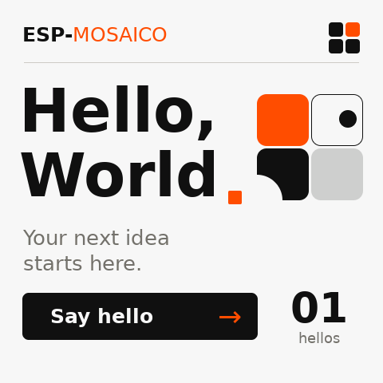

# 本机环境与验证记录

[工作流](vibe-coding-workflow_CN.md) · [官方资料](official-sources_CN.md)

日期：2026-10-01。这里记录本机实际检查结果，不能替代下一项目的验收。
`projects/hello_world` 是官方模板生成的环境验证工程；用户尚未选择业务应用。

## 环境

| 检查 | 结果 |
| --- | --- |
| 工作区来源 | `esp-mosaico/esp-mosaico-vibe`，基线 `95469e63b621fc6ece3b0e313af8c1ba59dcd066` |
| SDK | 精确 SHA `7b9cc1ac79f865983f59bb8ff3ff43eb74ff1dbe`，递归子模块完整，SDK 工作树干净 |
| 主机 | Apple Silicon macOS；Python 3.14.5，IDF / Iris 隔离环境 |
| 工具 | RISC-V GNU 16.1.0、CMake、Ninja、ccache、dfu-util；目标 `esp32s31` |
| 固定依赖 | Utils / BSP 已初始化；游戏引擎按需，未初始化 |
| 主机与构建 doctor | 通过；最初未连接设备的旧报告保留，后续连接证据见下文 |
| 模拟器 | 官方 GSP Simulator 1.5.1 / GSPC 0.6.1 |
| 项目 MCP | 共享配置随仓库存在，未验证本会话实际加载及调用 |

本机启动脚本为忽略目录中的 `.tools/activate.sh`，先校验 SDK SHA 再激活。没有修改全局 shell 启动文件。

Gateway 初次被动枚举曾报 `Project Gateway exited`；启动日志显示服务监听回环端口后退出。
仅对当前项目环境增加 `localhost,127.0.0.1,::1` 的 `NO_PROXY` / `no_proxy` 排除后，枚举成功；
将该设置加入激活脚本再执行同一查询，第二次也成功。此结果支持回环代理影响启动探测的判断，未修改上游 Gateway 源码。

## 构建、模拟器与离线包

| 验证 | 实测结果 |
| --- | --- |
| Hello World 固件构建 | `IDF LOW-NOISE BUILD: OK`，0 个警告 |
| 应用镜像 | 1,284,512 bytes；SHA-256 `d9a7d8dd7e057b1ad051ccd22fd46ef2d69654cc63fea45a5ab2dae49e57bcef` |
| UI 资源 | 96,784 bytes；SHA-256 `08bf096332709db2640171b26d2bd285ab09ef467144418c371a8638314de72b` |
| 原生模拟器 | 共享 C UI 编译及无窗口运行成功 |
| 交互 | 实际触发 Say hello 后计数从 0 变为 1；后端 `count=1, last_error=0`；截图已检查 |
| System Update 打包 | 官方 `system-update-bundle` target 成功，包大小 824,274 bytes |
| 官方离线 inspect | `chip_id=32`，16 MiB，release `1.0.0`；三个组件哈希与范围检查通过 |

包 SHA-256：`f79161115bf79d0bfa2d61ae7eb528605b545e291326ef312dc7ec381bb44a13`。

官方检查器输出的写入计划：

| 组件 | 目标地址 | 大小 |
| --- | ---: | ---: |
| `partition-table.bin` | `0x8000` | 4096 bytes，分区表区补齐后大小 |
| `ota_0.bin` | `0x210000` | 1,284,512 bytes |
| `ui_apps.bin` | `0xf00000` | 96,784 bytes |

该包为未签名开发包，`signature_verified=false`，不能把格式/哈希检查说成签名真实性验证。
它是 `.irisfw`，不能直接交给独立在线烧录器。本轮没有生成或验证自定义完整 BIN。

## 开发板和烧录边界

- 用户确认开发板已接入，CoreBoard V1.0 / V1.2 待确认。
- 官方在线烧录器成功显示 ESP32-S31、chip revision 0、16 MB Flash，并完成 ROM/stub 连接；chip revision 不代表 CoreBoard 版本。
- 本机被动枚举成功显示 `/dev/cu.usbmodem2101`，VID `0x303a`、PID `0x20`，ROM 接口存在；没有取得正常应用的 Iris Device ID、Boot ID 或健康状态。
- 未点击 Flash firmware，未执行 `recover` / `system-update` / `app-update`，未擦除或烧录任何镜像。
- 未验证屏幕触摸、相机、音频、传感器、联网、电池或 normal → Vibe Mode → normal 真机往返。

## 证据位置与版本管理

本机原始证据位于 Git 忽略目录，包含设备标识的记录不纳入公开文档：

- `.tools/environment.json`：路径、版本和产物摘要。
- `.tools/logs/doctor.json`：初次主机诊断。
- `.tools/logs/simulator-interaction.json` / `.log`：原生模拟器操作和后端结果。
- `.tools/logs/bundle-inspection.json`：官方离线包检查结果。
- `.tools/logs/device-discovery.json`：代理排除修正后的被动枚举。
- `projects/hello_world/.codex-runs/idf-low-noise-build/20261001-094906-build-18506/`：构建结果和原始日志。

本轮提交工作流、资料核对、验证记录、可公开截图和官方 Hello World 验证源码。源码保留字体许可证；SDK、构建产物、本机配置和原始设备日志不提交。
当前未配置 Git 作者身份，本地文档/验证基线提交使用明确的工具作者 `Codex <codex@local.invalid>`，仅对该次 commit 生效。未来业务项目优先使用用户已有 Git 身份。
本轮不新建 GitHub 仓库、不向官方 origin 推送；新项目命名确认后再创建用户的公开仓库。
